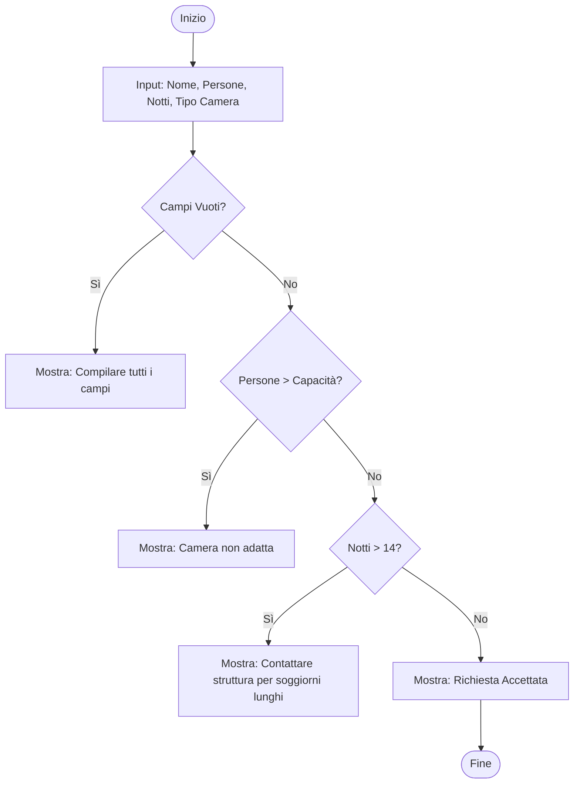

# Documento Architetturale dell'Applicativo - Hotel Booking App

## Diagramma di Flusso Logico
L'applicativo gestisce la validazione dei dati di prenotazione inseriti dall'utente.

## Logica dell'Applicativo
### Input
-   **Nome Cliente**: Stringa (obbligatoria).
-   **Numero di Persone**: Numerico (min 1).
-   **Numero di Notti**: Numerico (min 1).
-   **Tipo di Camera**: Selezione (Singola, Doppia, Tripla, Suite).

### Controlli Logici e Condizioni
1.  **Validazione Capacità**:
    -   Singola: max 1 ospite.
    -   Doppia: max 2 ospiti.
    -   Tripla: max 3 ospiti.
    -   Suite: max 5 ospiti.
    -   *Se superata*: Errore "Camera non adatta al numero di ospiti".
2.  **Validazione Durata**:
    -   Se notti > 14: Messaggio "Contattare la struttura per soggiorni prolungati".
    -   Se notti <= 0: Messaggio di errore generico.

### Principali Elaborazioni
L'applicativo legge i valori dal DOM tramite TypeScript, esegue i confronti logici definiti e aggiorna dinamicamente una sezione di output (div) per fornire feedback immediato all'utente senza ricaricare la pagina.

### Output
-   Messaggio di Errore (colore rosso) in caso di dati non validi o incompatibili.
-   Messaggio di Successo (colore verde) con riepilogo dei dati in caso di validazione positiva.
