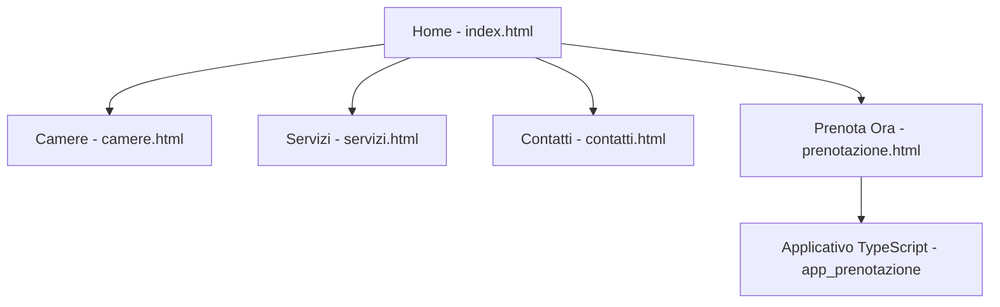

# Documento Architetturale del Sito - Hotel Splendid

## Alberatura del Sito (Site Map)
Il sito è composto da 5 pagine principali collegate tra loro tramite un menu di navigazione globale.

## Descrizione delle Sezioni Principali
1.  **Home Page (`index.html`)**: Presentazione dell'hotel, filosofia e offerte in evidenza.
2.  **Camere (`camere.html`)**: Elenco dettagliato delle tipologie di camere disponibili (Singola, Doppia, Tripla, Suite) con relative capacità massime.
3.  **Servizi (`servizi.html`)**: Descrizione dei servizi offerti (SPA, Ristorante, Wi-Fi, Navetta).
4.  **Contatti (`contatti.html`)**: Informazioni di contatto, indirizzo e modulo di messaggistica semplice.
5.  **Prenota Ora (`prenotazione.html`)**: Pagina di atterraggio per la prenotazione con link diretto all'applicativo logico.

## Navigazione
La navigazione è garantita da un `header` e un `nav` presenti in ogni pagina, permettendo all'utente di spostarsi liberamente tra le sezioni del sito. La pagina di prenotazione funge da ponte verso l'applicativo TypeScript esterno.
